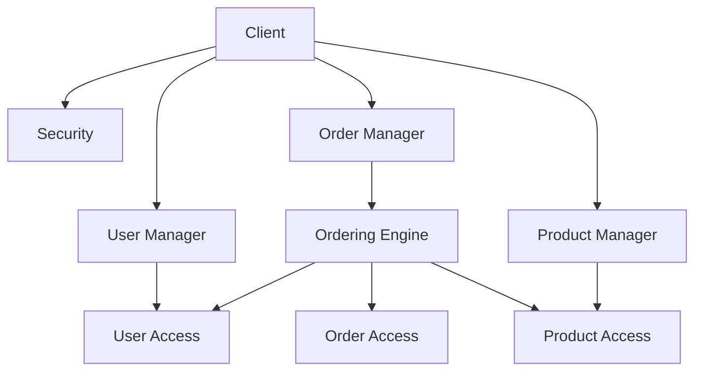

# Requirements

1. User registration (Register with an email address and password and confirm password), with email validation.
2. User login (with an email address and password).
3. Display a list of products (show product image, product name, price and quantity).
4. A ‘add to cart' button next to each product.
5. View shopping cart (show the product, quantity and price with a Total value of all the products selected).
6. Checkout button (send an email to the logged-in users' email address with all the products they have purchased with an order number).
7. Store user information in a database as well as the products purchased for each user against an order number.

# Use-Cases
## Core Use-Case

1. Allow users to purchase products.

## Technical Requirements

1. *Who*: customer
2. *What*: puchase products, send emails
3. *How*: resource access
4. *Where*: local database

### Customers

1. Allow the user to register using their email address. 
2. The password should be stored as using a salted hash.
3. Verify the user's email address by sending them a verification link via email.

### Products

1. Store product information, and stock.

### Orders

2. Store cart information.
3. Allow products to be added to a shopping cart.
4. Provide access to the shopping cart.
5. Warn user is product is no longer available.
6. Checkout decreases quantity of stock and sends an email receipt.

# Layered Architecture

## Resource Access

### Order Access
1. Add to cart
1. Remove from cart
1. Get cart (supports pagination)
1. Update product qantity in cart
1. Complete order (store order)

### Product Access
1. Reserve quantity (reduce quantity against a cart)
1. Undo reservation (re-add stock)
1. Checkout (commit reserved quantities)

### User Access
1. Register user
1. Validate user
8. Get products (supports pagination)
